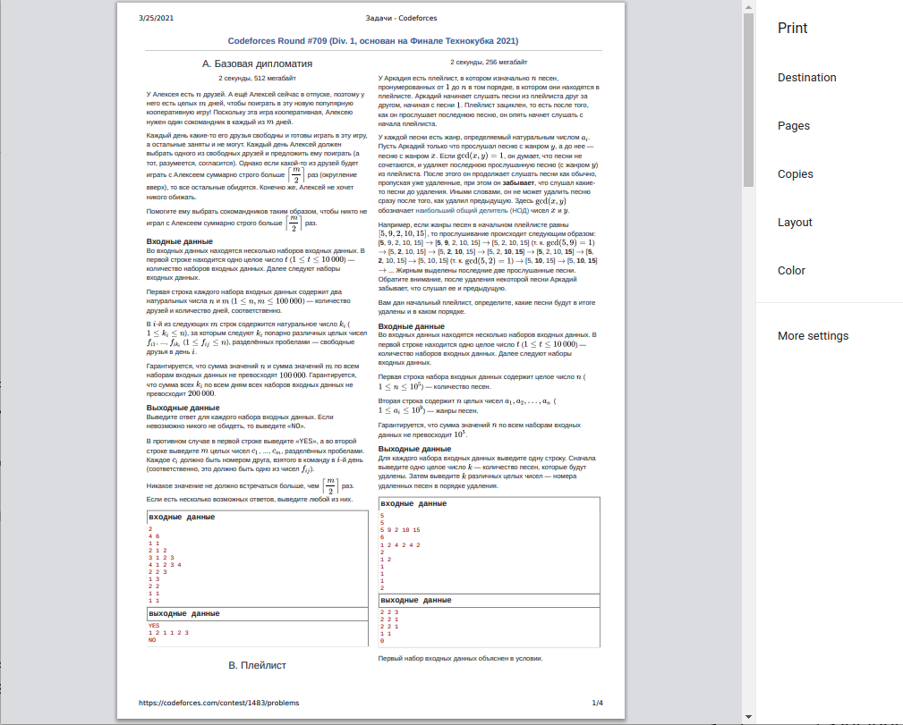
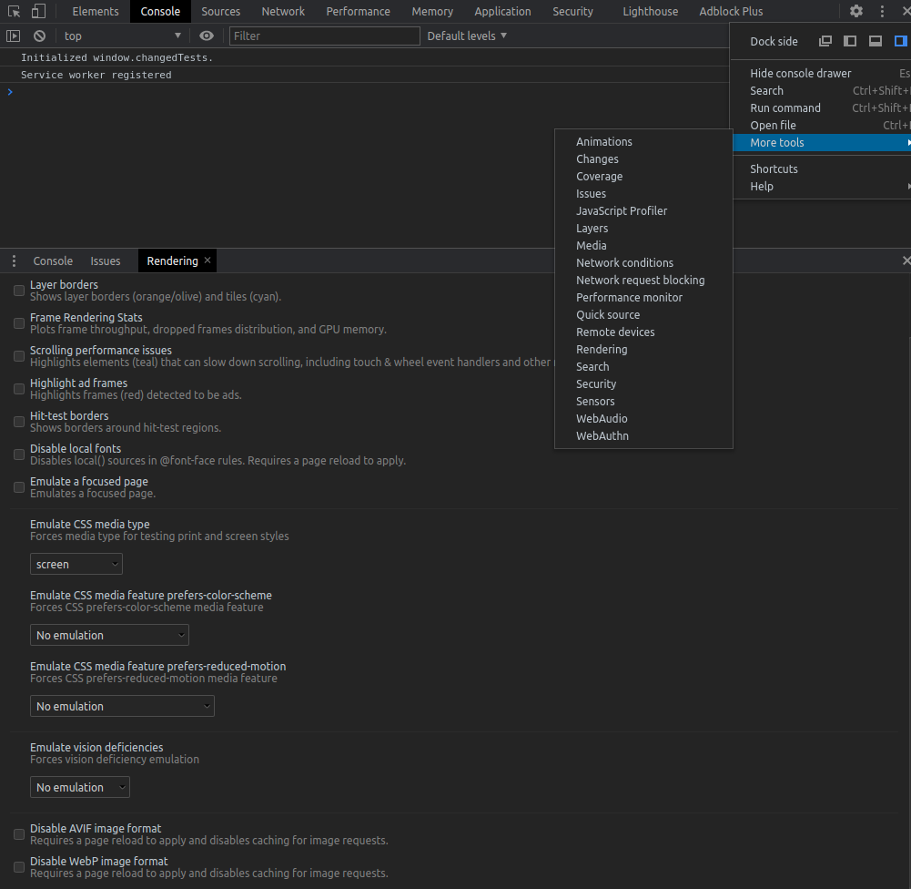
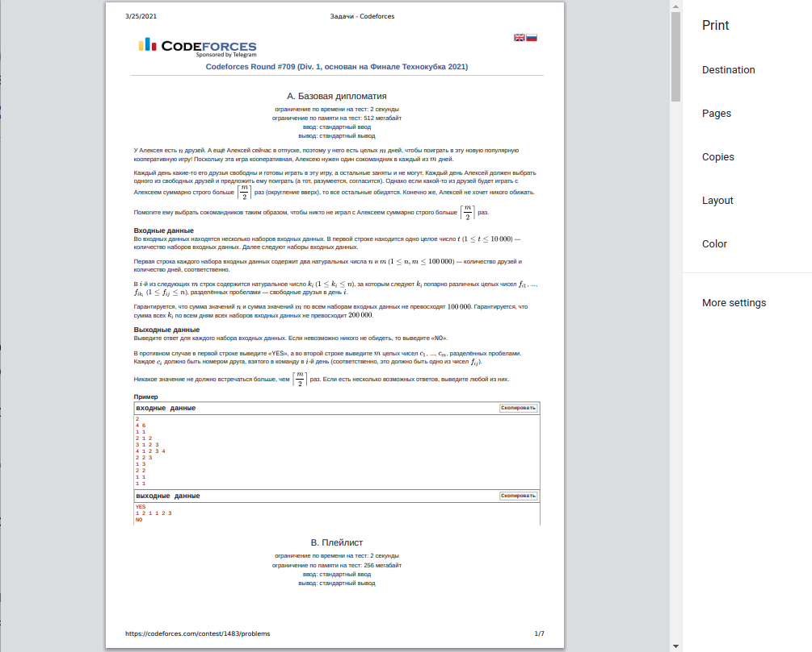

## Печать условий с codeforces

Если нужно распечатать условия со вкладки "все задачи" с сайта codeforces, то по умолчанию они будут печататься в
две колонки:

Чтобы решить эту проблему, в браузере (chrome) в инспекторе (`Ctrl+Shift+I`) во вкладке Console, нажать сверху справа 
на три точки, там в `More Tools` открыть `Rendering`. В появившемся окошке снизу в поле `Emulate CSS media type` выбрать 
`screen`

После этого печать должна происходить в одну колонку:

