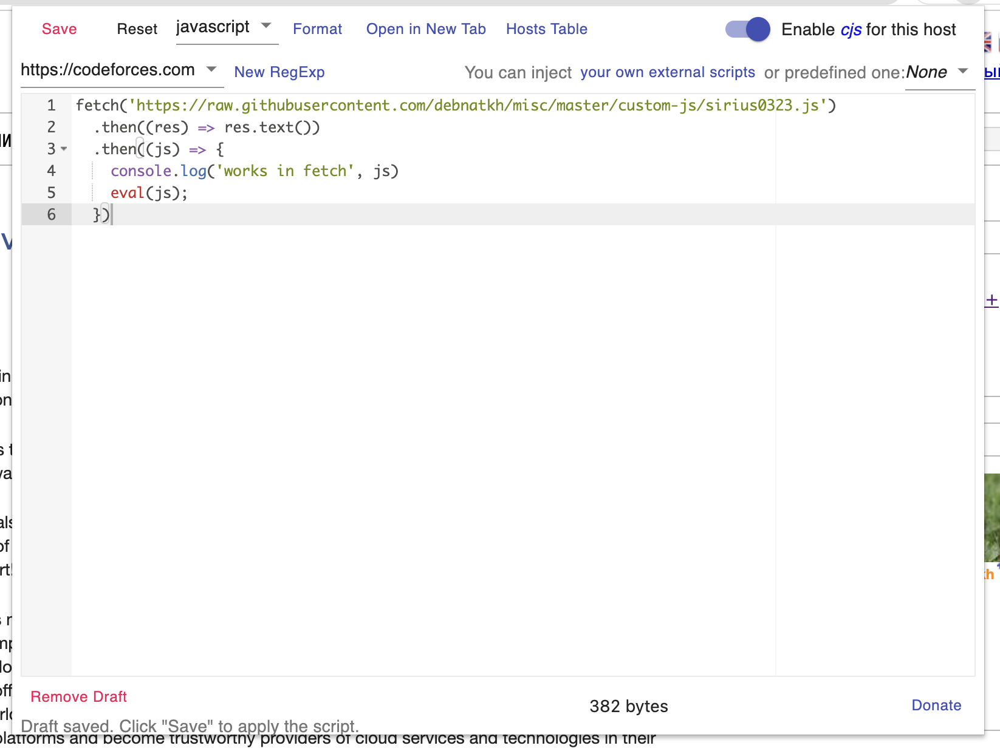

### Свои имена учатников на codeforces

Если хотим поменять отображаемые на codeforces имена участников, надо сделать так:

1. Установить расширение для Chrome [Custom JavaScript for Websites 2](https://chrome.google.com/webstore/detail/custom-javascript-for-web/ddbjnfjiigjmcpcpkmhogomapikjbjdk)

2. На codeforces.com нажать на расширение и в появившемся окне ввести[^1]:

```js
fetch('https://raw.githubusercontent.com/debnatkh/misc/master/custom-js/sirius0323.js')
  .then((res) => res.text())
  .then((js) => {
    console.log('works in fetch', js)
    eval(js);
  })
```



3. Нажать на кнопку Save

4. Перезагрузить любую страницу с результатами

[^1]: **NB: Обратите внимание!**
Ссылка в коде (вместо https://raw.githubusercontent.com/debnatkh/misc/master/custom-js/sirius0323.js) должна указывать на файл такого же содержания, но с вашим собственным маппингом пользователей
