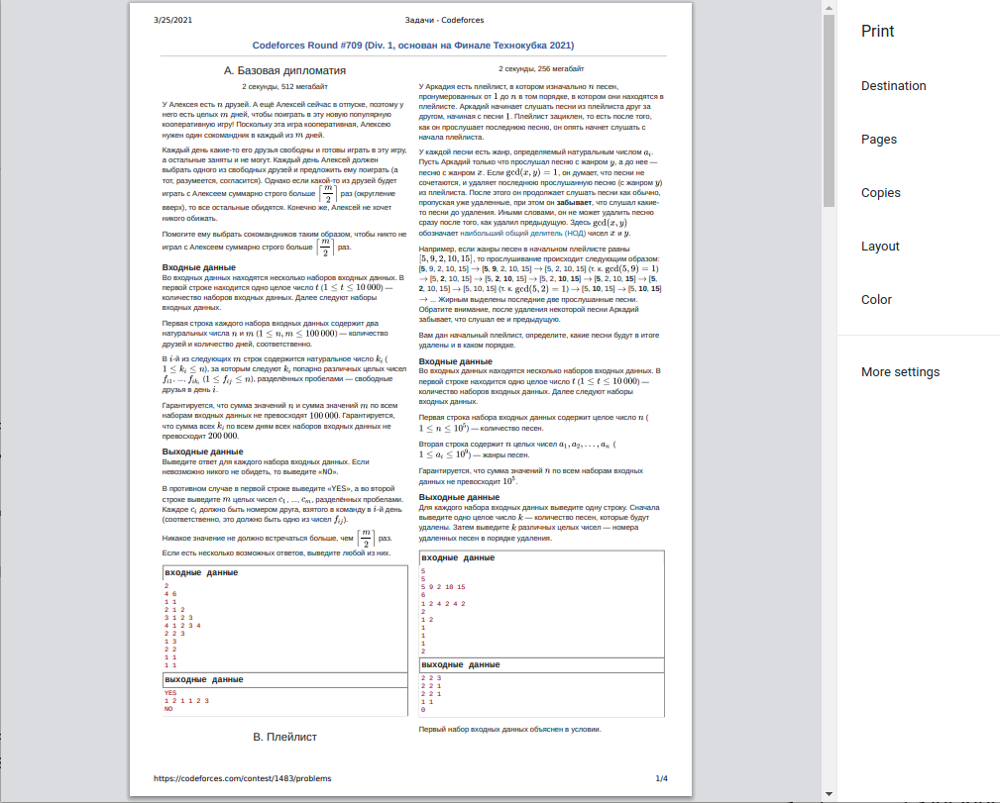
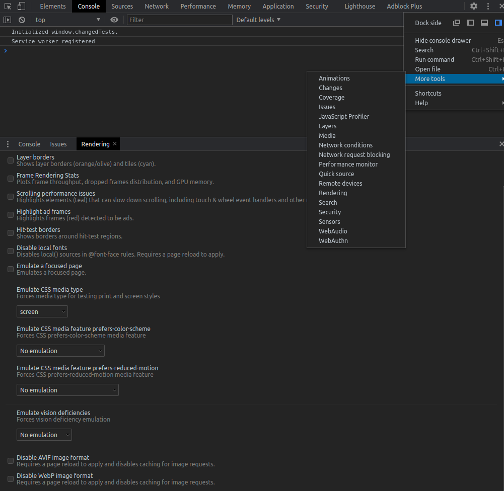
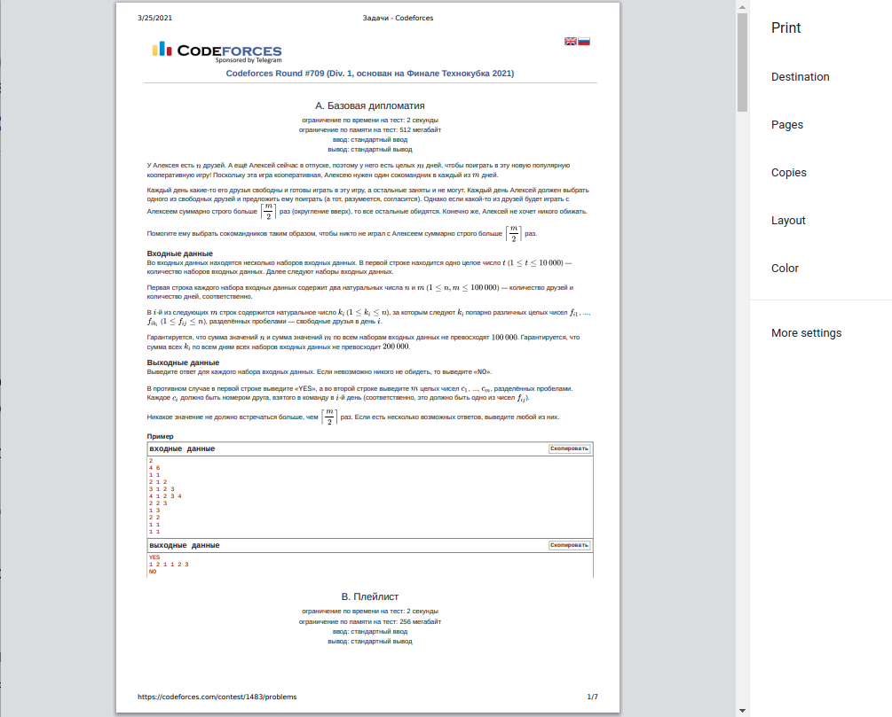

## Заливка задач на полигон из собранного в polygon архива

**На Linux:**

0. Установить [polygon-cli](https://github.com/kunyavskiy/polygon-cli) как сказано в репозитории. 
После этого команда `polygon-cli` должна работать из терминала. Если не работает, можно сделать 
`alias polygon-cli="<path-to-polygon-cli.run.py>""`
1. Скачать polygon-пакет, например, с [neerc.ifmo.ru/school/archive/...](https://neerc.ifmo.ru/school)
2. Разархивировать этот пакет в какую-нибудь папку
3. Создать задачу, в которую вы будете заливать на своём полигоне, например, `stolen-problem`, 
начать её редактирование а полигоне (кнопка Start)
4. В папке с распакованной задачей (там ещё должен лежать `problem.xml`) выполнить `polygon-cli
init stolen-problem`. При первом запуске `polygon-cli` потребует API-ключи и логин-пароль от полигона. 
Первое можно получить в настройках полигона
5. В папке с распакованной задачей выполнить `polygon-cli import_package .`
6. Теперь задачу можно продолжить редактировать/закоммитить/собрать из интерфейса полигона.

**На Windows:**

Вроде должно работать то же самое, но мной это не проверялось

## Картинки в полигоне

Можно делать векторные картинки в формате .eps с помощью библиотеки [https://ru.wikipedia.org/wiki/PGF/Tikz](TiKz) 
для LaTeX. Примеры см. в [/templates/tikz-eps/drawing.tex]().

```latex
\begin{figure}[!htbp]
   \centering
   \includegraphics{drawing-figure4.eps}
\end{figure}
```

## Заливка условий в полигон

Очень удобно использовать программу [mathpix](https://mathpix.com/), которая умеет парсить TeX прямо из скриншота. Ещё с
её помощью можно распарсить табличку с разбалловкой. После установки, регистрации и запуска, достаточно нажать Ctrl+Alt+M 
и выделить текст, который хочется распарсить.

## Чекер на Pascal-е

Если в заливаемой задаче чекер — это `check.dpr`, то в секцию files нужно добавить [testlib.pas](./testlib.pas)

## Печать условий с codeforces

Если нужно распечатать условия со вкладки "все задачи" с сайта codeforces, то по умолчанию они будут печататься в
две колонки:



Чтобы решить эту проблему, в браузере (chrome) в инспекторе (`Ctrl+Shift+I`) во вкладке Console, нажать сверху справа 
на три точки, там в `More Tools` открыть `Rendering`. В появившемся окошке снизу в поле `Emulate CSS media type` выбрать 
`screen`



После этого печать должна происходить в одну колонку:


